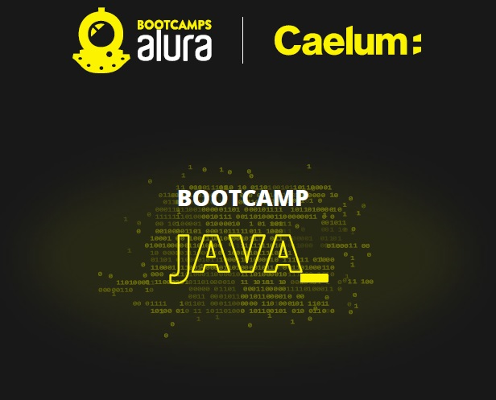

# Project Livraria-API 
REST API to control a digital library. 
Project developed during [Alura Bootcamp Java](https://www.alura.com.br/bootcamp/back-end-java/matriculas-abertas). 

  
 

# Technologies used
* Spring
  - [Spring Initializr](https://start.spring.io/)
  - [Spring Web](https://spring.io/guides/gs/serving-web-content/)
  - [Spring Dev Tools](https://docs.spring.io/spring-boot/docs/1.5.16.RELEASE/reference/html/using-boot-devtools.html)
  - [Spring Validation](https://www.baeldung.com/spring-boot-bean-validation)
  - Spring Boot
* [Maven](https://maven.apache.org/)
* [ModelMapper](http://modelmapper.org/)
* [Project Lombok](https://projectlombok.org/)
* Java 11
* JPA/[Hibernate](https://hibernate.org/orm/)
* [Flyway](https://flywaydb.org/documentation/)
* Automated tests
  - [JUnit](https://junit.org/junit5/docs/current/user-guide/)
  - [MockMvc](https://www.baeldung.com/integration-testing-in-spring#3-mocking-web-context-beans/)
  - [AssertJ](https://assertj.github.io/doc/)
* Datasources
    - [MySql](https://www.mysql.com/)
    - [H2 Database Engine](https://www.h2database.com/html/cheatSheet.html)

# API Test
* [Postman](https://www.postman.com/)
  - [Postman collection](https://github.com/oluizeduardo/livraria-api/tree/main/postman)

# Documentation tool
* [Swagger](https://www.baeldung.com/swagger-2-documentation-for-spring-rest-api)
> **_NOTE:_**  As soon as you run the application, check the documentation at http://localhost:8080/swagger-ui.html.

# How to run
Execute the class `LivrariaApiApplication.java` as a normal Java Application.

# Endpoints

| METHOD        | END-POINT                     | DESCRIPTION                    | FIELDS                                         |
| ------------- |:-----------------------------:| :-----------------------------:|:----------------------------------------------:|
| POST          | http://localhost:8080/auth    |  User authentication           | login, password                                |
| POST          | http://localhost:8080/autores |  Register a new author.        | nome, dataNascimento, nacionalidade, curriculo |
| GET           | http://localhost:8080/autores |  Get a list of authors.        |    |
| PUT           | http://localhost:8080/autores |  Update an author.             | nome, dataNascimento, nacionalidade, curriculo   |
| DELETE        | http://localhost:8080/autores |  Delete an author.             |   |
| GET           | http://localhost:8080/autores/{id} |  Get an author's details. |    |
| POST          | http://localhost:8080/livros  |  Register a new book.          | titulo, dataLancamento, numeroPaginas, autor   |
| GET           | http://localhost:8080/livros  |  Get a list of books.          |    |
| PUT           | http://localhost:8080/livros |  Update a book.             | titulo, dataLancamento, numeroPaginas, autor   |
| DELETE        | http://localhost:8080/livros |  Delete a book.             |   |
| GET           | http://localhost:8080/livros/{id} |  Get a a book's details. |    |
| GET           | http://localhost:8080/relatorios/livraria  |  Get the library reports.          |    |
| GET           | http://localhost:8080/usuarios |  Get a list of users |    |
| POST          | http://localhost:8080/usuarios  |  Register a new user.          | login, nome, perfilId    |
| GET           | http://localhost:8080/usuarios/{id}  |  Get a user's details.          |    |
| PUT           | http://localhost:8080/usuarios |  Update a user's details.             | id, login, nome, perfilId   |
| DELETE        | http://localhost:8080/usuarios/{id} |  Delete a user.             |   |

